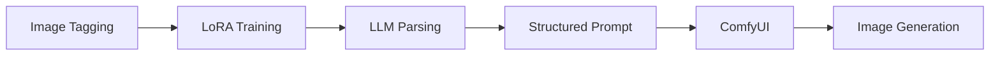

# Guowen (Christopher) Tang

MS Applied Data Science @ **University of Chicago** (2026–2027) · 
B.A. CS & B.S. Mathematical Business @ **Wake Forest University**

I build machine learning and LLM-based systems that turn messy data 
into business decisions. Currently seeking **Data Science internships**.

📍 Chicago, IL · 📫 guowent0309@outlook.com · 
💼 [LinkedIn](https://www.linkedin.com/in/guowen-tang0309/)

---

## 🔭 What I Work On

- **Machine Learning & Forecasting**: gradient boosting (XGBoost, LightGBM, CatBoost), survival modeling, time series, causal discovery
- **LLM & Agentic AI**: RAG, multi-agent systems (Microsoft AutoGen), workflow automation
- **Computer Vision**: YOLO, RT-DETR, CLIP on UAV imagery
- **Analytics & Storytelling**: A/B testing, SHAP interpretability, Tableau, Power BI

## 🛠 Tech Stack

## 🎨 AIGC Workflow (Tencent IEG Internship)

During my internship, I built an end-to-end AIGC pipeline that connects
asset understanding to controllable image generation:

| Stage | What I did |
|---|---|
| **1. Image tagging** | Automated AI tagging for 102 game assets, reducing manual labeling time by 90% |
| **2. LoRA training** | Trained LoRA models on tagged assets for downstream generation |
| **3. LLM parsing** | Used LLM to parse user requests / tags / design briefs into structured attributes |
| **4. Structured prompt** | Converted parsed attributes into standardized prompts with a fixed schema |
| **5. ComfyUI → generation** | Triggered ComfyUI workflows with the structured prompts and LoRAs to generate images |

*Details are kept high-level due to confidentiality. No internal data, code, or assets are included in this repo.*

## 📈 ARPU Forecasting Tool (Tencent IEG Internship)

I built and deployed an SKU-level ARPU forecasting model that turned a recurring
manual analysis into a reusable tool for business users.

| Stage | What I did |
|---|---|
| **1. Data** | Gathered and structured SKU-level sales data |
| **2. Modeling** | Benchmarked CatBoost and LightGBM for SKU-level ARPU forecasting, reaching 0.01 MAE |
| **3. Packaging** | Packaged the model into a reusable prediction tool |
| **4. Deployment** | Deployed it on Tencent Cloud as an internal service for business users |
| **5. Impact** | Converted recurring analysis into a decision-support workflow |

*Details are kept high-level due to confidentiality. No internal data, code, or metrics beyond those listed are included.*

## 🎓 Education

| School | Degree | Time |
|---|---|---|
| **University of Chicago** | M.S. in Applied Data Science | Sep 2026 – Dec 2027 (Exp.) |
| **Wake Forest University** | B.A. in Computer Science & B.S. in Mathematical Business | Aug 2021 – May 2025 |

## 💼 Experience

- **Tencent IEG**, Business Analyst Intern (2025–2026): SHAP-driven monetization insights, AIGC workflow, ARPU forecasting tool
- **Bosch China**, Strategic Algorithm Intern (2025): causal discovery on 700+ sensors, AutoGen chatbot
- **WFU IRSC Lab**, Research Assistant (2025): UAV deep-learning pipeline

## 📫 Let's Connect

[LinkedIn](https://www.linkedin.com/in/guowen-tang0309/) · guowent0309@outlook.com